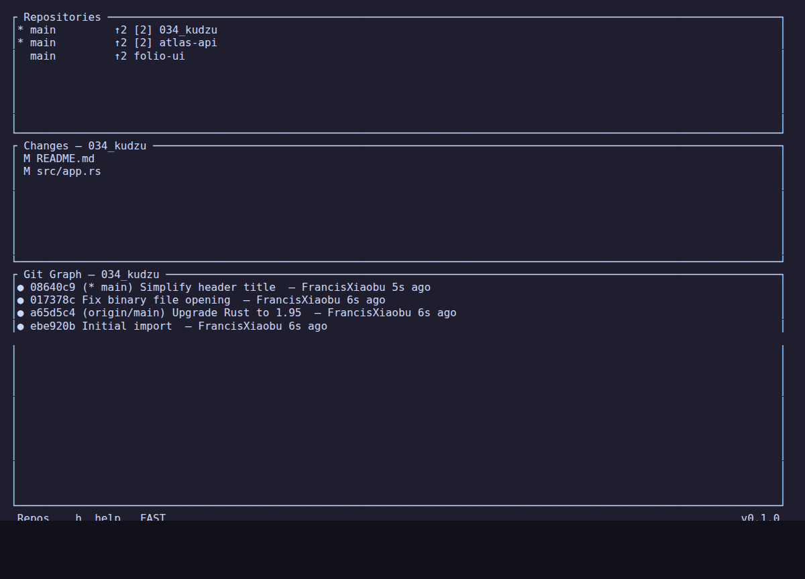
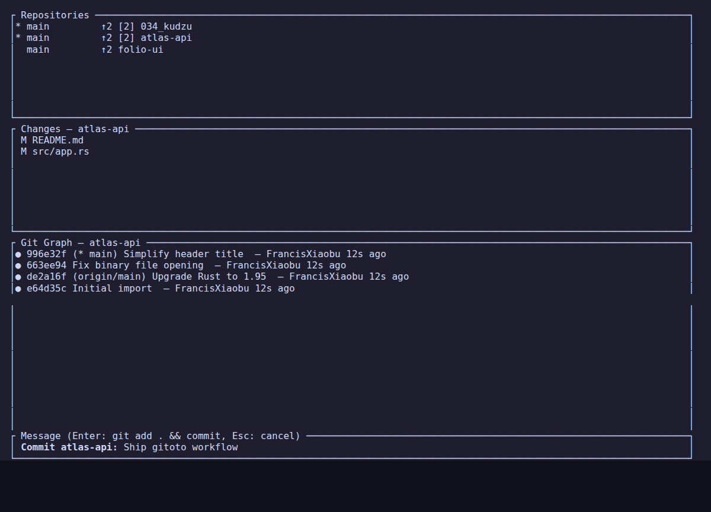
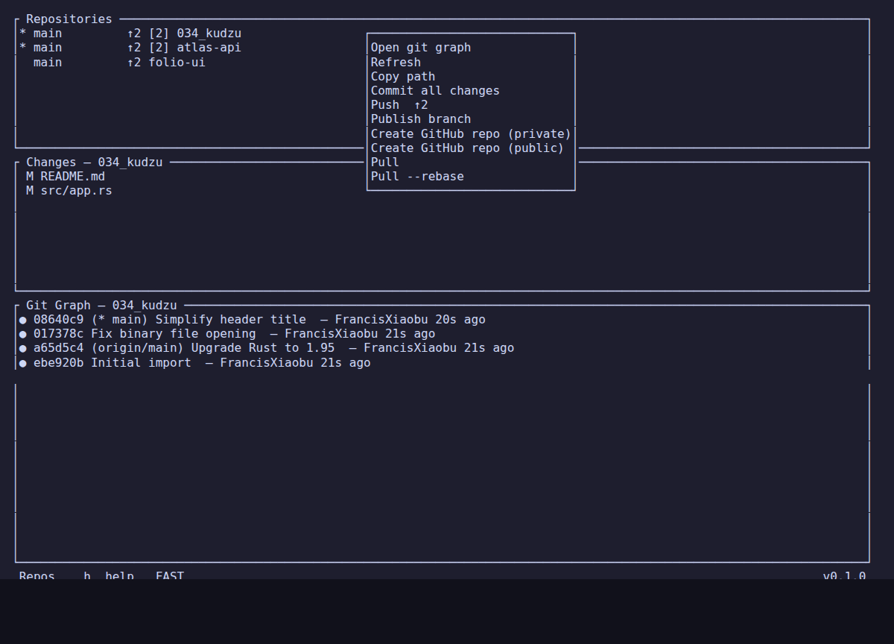
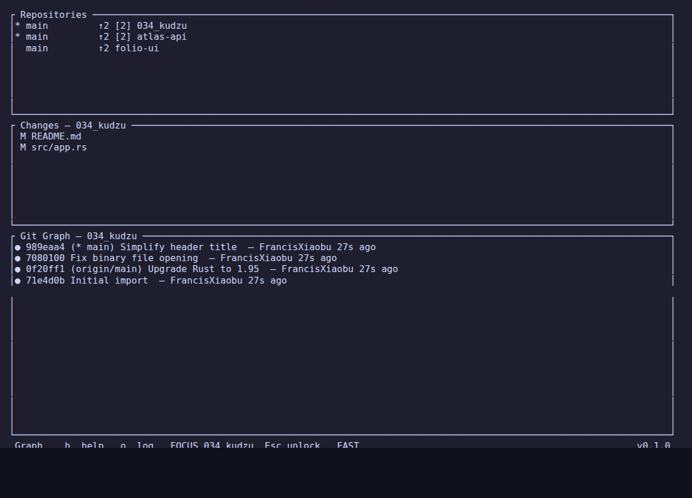
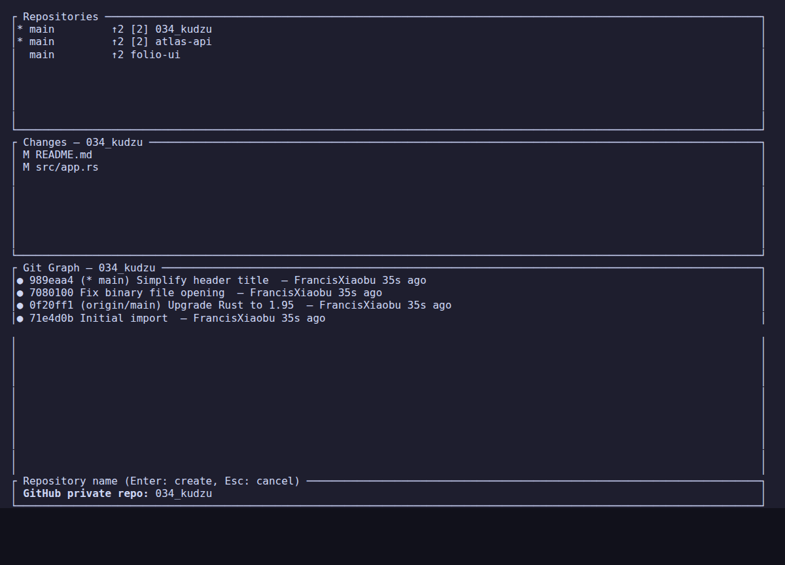
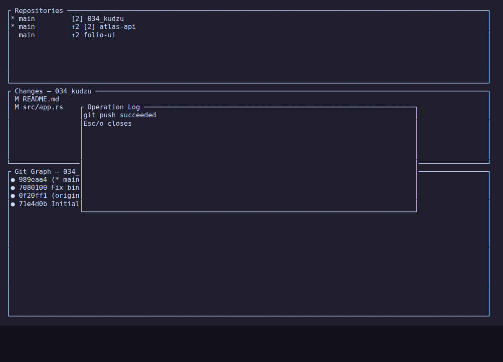

# gitoto

`gitoto` is a terminal multi-repository Git source control panel.

It is a fork and product variant of [affromero/gitpane](https://github.com/affromero/gitpane). The scanning, repository list, file list, diff view, graph view, Ratatui/Crossterm/Tokio architecture, and much of the original implementation come from `gitpane`. Respect and thanks to the original author and contributors for building the foundation this project extends.

This fork shifts the experience closer to VS Code Source Control for multiple repositories: see many repos at once, commit the selected repo, push tracked branches, and publish branches that do not have an upstream yet.

## Screenshots

### Multi-Repo Overview



### Commit Input



### Repo Context Menu



### Repo Focus Mode



### GitHub Repo Name Input



### Operation Log



## Install

From this repository:

```bash
cargo install --path .
```

This installs the binary as:

```bash
gitoto
```

Creating GitHub repositories from the context menu requires GitHub CLI:

```bash
gh auth login
gh auth setup-git
```

Run it from the folder you want to scan:

```bash
gitoto
```

Or scan a specific directory from anywhere:

```bash
gitoto --root ~/projects
```

Start in fast mode for very large repo sets:

```bash
gitoto --fast
```

## What Changed From gitpane

- `c` opens a commit message input for the selected repo.
- `Enter` in commit input runs `git add .` and `git commit -m "<message>"`.
- Empty commit messages are ignored.
- `Esc` cancels commit input.
- `p` pushes the selected repo only when the branch has an upstream.
- `P` publishes the selected branch with `git push -u origin <branch>`.
- The repo context menu can open the GitHub page, create a private or public GitHub repository when no GitHub remote exists, and remove `origin` with confirmation.
- Commit, push, publish, and GitHub repository creation failures are shown in the status bar.
- The original dashboard, file list, diff view, commit graph, worktree handling, ahead/behind status, and context menu are preserved.
- `rustls-webpki` is locked to a patched version, and CI includes dependency auditing.

## Keybindings

### Global

| Key | Action |
|-----|--------|
| `h` / `?` | Toggle paged help overlay |
| `Tab` / `Shift+Tab` | Cycle focus between panels |
| `r` | Refresh all repo statuses |
| `R` | Rescan directories for repos |
| `F` | Toggle fast mode |
| `o` | Show operation log |
| `g` | Reload git graph for selected repo |
| `a` | Add a repo |
| `c` | Commit selected repo from Repos/Changes |
| `p` | Push selected repo |
| `P` | Publish selected branch |
| `s` | Cycle sort order |
| `y` | Copy selected item to clipboard |
| `q` | Quit, or close diff if one is open |
| `Esc` | Close current view / go back |
| `Ctrl+C` | Quit immediately |

### Commit Input

| Key | Action |
|-----|--------|
| `Enter` | Run `git add .` and `git commit -m "<message>"` |
| `Esc` | Cancel |
| `Ctrl+A` / `Home` | Cursor to start |
| `Ctrl+E` / `End` | Cursor to end |
| `Ctrl+U` | Clear line before cursor |

### Repos Panel

| Key | Action |
|-----|--------|
| `j` / `Down` | Next repo |
| `k` / `Up` | Previous repo |
| `Enter` / double click | Focus this repo in Changes and Git Graph |
| `w` | Toggle linked worktrees |
| Right click | Open context menu; GitHub repos can open in the browser, and repos without a GitHub remote can create a private or public GitHub repo |

### Changes Panel

| Key | Action |
|-----|--------|
| `j` / `Down` | Next file |
| `k` / `Up` | Previous file |
| `Enter` | Open split diff view |
| `Esc` / `Left` | Close diff view |

### Graph Panel

| Key | Action |
|-----|--------|
| `j` / `Down` | Next commit / file |
| `k` / `Up` | Previous commit / file |
| `Left` / `Right` | Scroll graph left / right |
| `Enter` | Open commit files / file diff |
| `/` | Search commits |
| `n` / `N` | Next / previous search match |
| `f` | Toggle first-parent mode |
| `c` | Collapse / expand branch in graph view |
| `H` | Expand all collapsed branches |

## Configuration

Config file:

```text
~/.config/gitoto/config.toml
```

Example:

```toml
root_dirs = ["~/Code", "~/projects"]
scan_depth = 2
pinned_repos = []
excluded_repos = ["node_modules", ".cargo", "target"]

[watch]
debounce_ms = 500
poll_local_secs = 5
poll_fetch_secs = 30
max_concurrent_polls = 4
poll_local_full_every = 12
watch_exclude_dirs = ["node_modules", "target", ".build", "dist", "vendor"]

[ui]
frame_rate = 10
check_for_updates = false
update_position = "top-right"

[graph]
branches = "all"
label_max_len = 24
show_stats = true

[submodules]
ignore_dirty = false

[status]
# "all" recursively scans untracked directories.
# "normal" reports untracked directory entries without expanding them.
# "none" skips untracked files for fastest large-repo scans.
untracked = "all"

[performance]
# Fast mode disables automatic fetch polling, graph diff stats, and untracked scans.
fast_mode = false

[commit]
# Set to true to commit with --no-verify and skip repository hooks.
no_verify = false
```

## Security Notes

`gitoto` runs Git commands in selected repositories. Commit uses structured process arguments rather than a shell, so commit messages are not shell-expanded. Git itself may still run repository hooks during `git commit`; enable `[commit] no_verify = true` for untrusted repos if you do not want hooks to run.

Dependency security is checked with `cargo audit` in CI. Dependabot is configured for Cargo and GitHub Actions updates.

## Development

Run the local checks:

```bash
cargo fmt
cargo test
cargo clippy --all-targets --all-features -- -D warnings
cargo audit
```

Regenerate README screenshots:

```bash
just screenshots
```

Install the local binary:

```bash
cargo install --path .
```

## Attribution

`gitoto` is derived from [gitpane](https://github.com/affromero/gitpane), originally created by Antonio F. F. Romero. This fork is intended as a focused Source Control-style variant, not a replacement for the original project. Thank you to the `gitpane` project for the architecture, UI foundation, and Git dashboard capabilities that made this variant possible.
